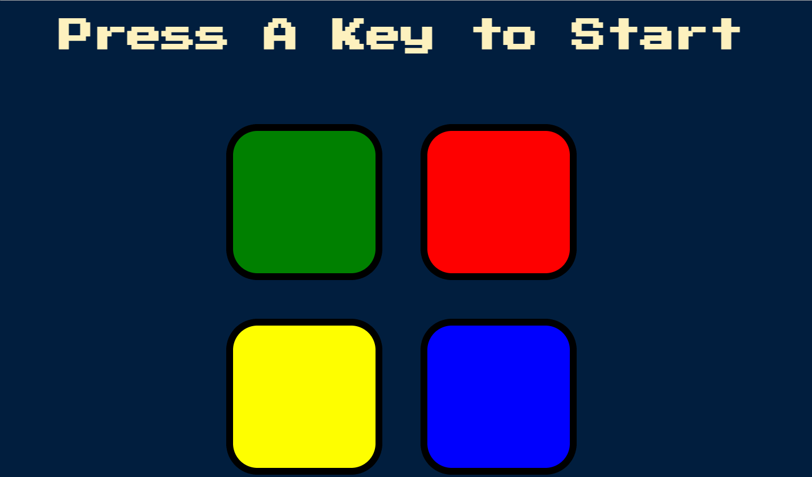

## Simon Game

- Simon is an electronic game of short-term memory skill, which creates a series of tones and lights and requires a user to repeat the sequence.
- If the user succeeds, the series becomes progressively longer and more complex.
- Developed using HTML, CSS and JavaScript.
- <a href="https://akshit1903.github.io/SimonGame/">Deployed Link</a>
- <a href="https://youtu.be/ZKW_x25S6Vc">YouTube</a>

